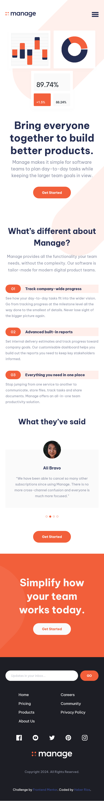

# Frontend Mentor - Manage landing page solution

This is a solution to the [Manage landing page challenge on Frontend Mentor](https://www.frontendmentor.io/challenges/manage-landing-page-SLXqC6P5).

## Table of contents

- [Frontend Mentor - Manage landing page solution](#frontend-mentor---manage-landing-page-solution)
  - [Table of contents](#table-of-contents)
  - [Overview](#overview)
    - [The challenge](#the-challenge)
    - [Screenshot](#screenshot)
    - [Links](#links)
  - [My process](#my-process)
    - [Built with](#built-with)
    - [What I learned](#what-i-learned)
    - [Continued development](#continued-development)
    - [Useful resources](#useful-resources)
  - [Author](#author)
  - [Acknowledgments](#acknowledgments)

## Overview

### The challenge

Users should be able to:

-   View the optimal layout for the site depending on their device's screen size
-   See hover states for all interactive elements on the page
-   See all testimonials in a horizontal slider
-   Receive an error message when the newsletter sign up `form` is submitted if:
    -   The `input` field is empty
    -   The email address is not formatted correctly

### Screenshot

-   Desktop design 
-   Mobile design 

### Links

-   [Solution URL](https://www.frontendmentor.io/solutions/manage-landing-page-NiwdnmMTwL)
-   [Live Site URL](https://heberrios.github.io/manage-landing-page/)

## My process

### Built with

-   Semantic HTML5 markup
-   CSS custom properties
-   CSS Flexbox
-   CSS GRID
-   Mobile-first workflow
-   JavaScript

### What I learned

Basic functionality for a testimonial carousel.

### Continued development

Have a better understanding of semantic HTML and fluid typography.

Have better website layout building sense.

### Useful resources

-   [Why use rem instead of px](https://www.youtube.com/watch?v=xCSw6bPXZks) - This taught me
    a new best practice for responsive design.

-   [Use of clamp](https://www.youtube.com/watch?v=erqRw3E-vn4&t=202s) - This is an amazing article which helped me understand CSS clamp better. I'd recommend it to anyone still learning this concept.

## Author

-   Frontend Mentor - [@HeberRios](https://www.frontendmentor.io/profile/HeberRios)

## Acknowledgments

-   Frontend Mentor - [@JEWebDev](https://www.frontendmentor.io/profile/JEWebDev)
